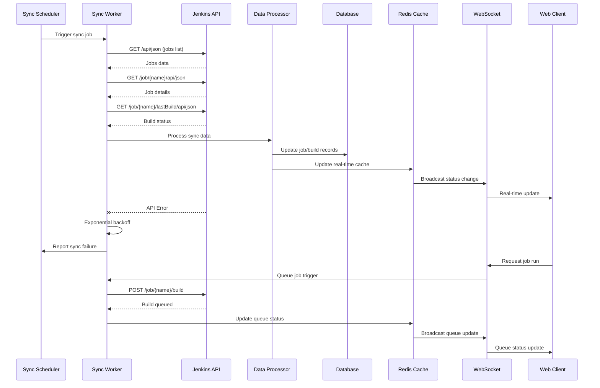

# REST API Design

## API Endpoints

### Authentication & Users

```http
POST   /auth/login                    # User login
POST   /auth/logout                   # User logout
GET    /auth/me                       # Current user info
GET    /users                         # List users (admin)
POST   /users                         # Create user (admin)
PUT    /users/{id}                    # Update user
```

### Jenkins Servers (Admin)

```http
GET    /admin/servers                 # List Jenkins servers
POST   /admin/servers                 # Add Jenkins server
PUT    /admin/servers/{id}            # Update server config
DELETE /admin/servers/{id}            # Remove server
POST   /admin/servers/{id}/test       # Test connection
POST   /admin/servers/{id}/sync       # Manual sync trigger
```

### Permissions

```http
GET    /permissions/requests          # List permission requests
POST   /permissions/requests          # Create permission request
PUT    /permissions/requests/{id}     # Update request (approve/reject)
GET    /permissions/history           # Permission history
GET    /permissions/my-permissions    # Current user's permissions
```

### Jobs

```http
GET    /jobs                          # List jobs (with filters)
GET    /jobs/{id}                     # Get job details
POST   /jobs                          # Create job request
PUT    /jobs/{id}                     # Update job
DELETE /jobs/{id}                     # Delete job
POST   /jobs/{id}/run                 # Trigger job build
GET    /jobs/{id}/builds              # Job build history
GET    /jobs/{id}/builds/{buildId}    # Specific build details
GET    /jobs/{id}/builds/{buildId}/logs # Build logs
POST   /jobs/{id}/builds/{buildId}/abort # Abort build
```

### Job Builds & History

```http
GET    /builds                        # All builds (with filters)
GET    /builds/{id}                   # Build details
GET    /builds/{id}/stages            # Build stages
GET    /builds/{id}/stages/{stageId}/logs # Stage logs
POST   /builds/{id}/stages/{stageId}/approve # Approve stage
POST   /builds/{id}/stages/{stageId}/reject # Reject stage
```

### Dashboard

```http
GET    /dashboard/timeline            # Deploy timeline data
GET    /dashboard/agents              # Agent status summary
GET    /dashboard/queue               # Build queue status
GET    /dashboard/libraries           # Shared library versions
GET    /dashboard/metrics             # System metrics
```

### System Admin

```http
GET    /admin/config                  # System configuration
PUT    /admin/config                  # Update system config
GET    /admin/audit                   # Audit logs
GET    /admin/health                  # System health check
```

## Query Parameters & Filtering

### Common Filters

```http
GET /jobs?server=1&status=running&page=1&limit=20&sort=name
GET /builds?job_id=123&status=SUCCESS&from_date=2024-01-01&to_date=2024-01-31
GET /permissions/history?user_id=456&export=csv
```

### Pagination Response Format

```json
{
  "data": [...],
  "pagination": {
    "page": 1,
    "limit": 20,
    "total": 150,
    "pages": 8,
    "has_next": true,
    "has_prev": false
  }
}
```

## WebSocket Events (Real-time Updates)

```javascript
// WebSocket endpoint: wss://api.releasy.company.com/ws

// Client subscribes to events
{
  "action": "subscribe",
  "topics": ["builds", "agents", "queue"]
}

// Server sends real-time updates
{
  "topic": "builds",
  "event": "build_started",
  "data": {
    "job_id": 123,
    "build_number": 456,
    "started_by": "user123"
  }
}
```

## Error Response Format

```json
{
  "error": {
    "code": "PERMISSION_DENIED",
    "message": "You don't have permission to access this resource",
    "details": {
      "required_permission": "job:edit",
      "resource": "job:123"
    }
  }
}
```

## Rate Limiting

```http
X-RateLimit-Limit: 1000
X-RateLimit-Remaining: 999
X-RateLimit-Reset: 1640995200
```

## Data Synchronization Flow



## Sync Intervals

- **Critical Data**: Every 30 seconds (build status, queue)
- **Moderate Data**: Every 2 minutes (job configs, agent status)
- **Static Data**: Every 15 minutes (libraries, system info)

## Sync Process

1. **Incremental Sync**: Only fetch changed data using Jenkins API timestamps
2. **Full Sync**: Complete data refresh every 6 hours
3. **Error Handling**: Exponential backoff for failed API calls
4. **Conflict Resolution**: Jenkins data takes precedence over local changes

## Performance Optimizations

- Connection pooling for database
- Redis caching for frequently accessed data
- API response compression
- Database query optimization with proper indexing
- Background job processing for heavy operations
