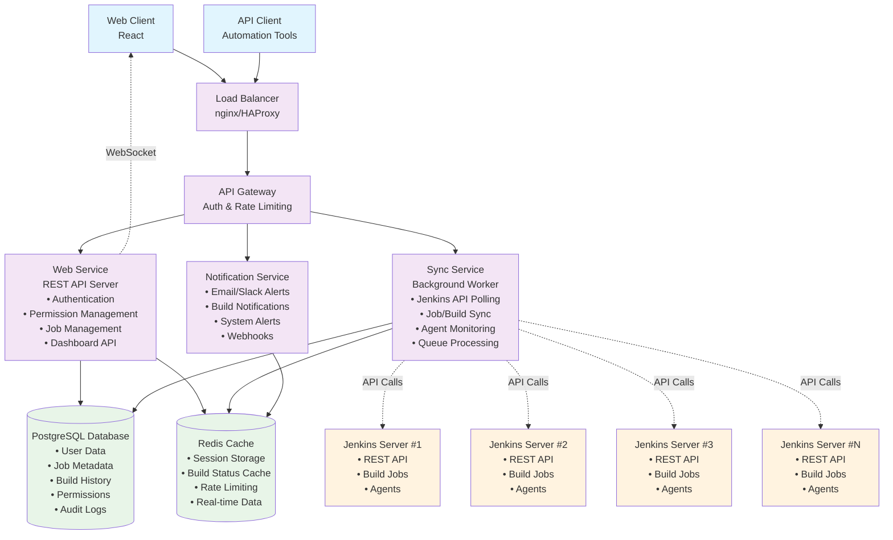

# System Architecture

## High-Level Architecture

```mermaid
graph TB
    %% Client Layer
    WebClient[Web Client<br/>React]
    APIClient[API Client<br/>Automation Tools]

    %% Load Balancer
    LB[Load Balancer<br/>nginx/HAProxy]

    %% API Gateway
    Gateway[API Gateway<br/>Auth & Rate Limiting]

    %% Application Services
    WebService[Web Service<br/>REST API Server<br/>• Authentication<br/>• Permission Management<br/>• Job Management<br/>• Dashboard API]

    SyncService[Sync Service<br/>Background Worker<br/>• Jenkins API Polling<br/>• Job/Build Sync<br/>• Agent Monitoring<br/>• Queue Processing]

    NotificationService[Notification Service<br/>• Email/Slack Alerts<br/>• Build Notifications<br/>• System Alerts<br/>• Webhooks]

    %% Data Layer
    Database[(PostgreSQL Database<br/>• User Data<br/>• Job Metadata<br/>• Build History<br/>• Permissions<br/>• Audit Logs)]

    Cache[(Redis Cache<br/>• Session Storage<br/>• Build Status Cache<br/>• Rate Limiting<br/>• Real-time Data)]

    %% External Jenkins Servers
    Jenkins1[Jenkins Server #1<br/>• REST API<br/>• Build Jobs<br/>• Agents]
    Jenkins2[Jenkins Server #2<br/>• REST API<br/>• Build Jobs<br/>• Agents]
    Jenkins3[Jenkins Server #3<br/>• REST API<br/>• Build Jobs<br/>• Agents]
    JenkinsN[Jenkins Server #N<br/>• REST API<br/>• Build Jobs<br/>• Agents]

    %% Connections
    WebClient --> LB
    APIClient --> LB
    LB --> Gateway
    Gateway --> WebService
    Gateway --> SyncService
    Gateway --> NotificationService

    WebService --> Database
    WebService --> Cache
    SyncService --> Database
    SyncService --> Cache
    NotificationService --> Cache

    SyncService -.->|API Calls| Jenkins1
    SyncService -.->|API Calls| Jenkins2
    SyncService -.->|API Calls| Jenkins3
    SyncService -.->|API Calls| JenkinsN

    %% WebSocket for real-time updates
    WebService -.->|WebSocket| WebClient

    %% Styling
    classDef clientLayer fill:#e1f5fe
    classDef serviceLayer fill:#f3e5f5
    classDef dataLayer fill:#e8f5e8
    classDef jenkinsLayer fill:#fff3e0

    class WebClient,APIClient clientLayer
    class WebService,SyncService,NotificationService,Gateway,LB serviceLayer
    class Database,Cache dataLayer
    class Jenkins1,Jenkins2,Jenkins3,JenkinsN jenkinsLayer
```

## Component Details

```mermaid
graph TB
    subgraph "Web Service Components"
        AuthController[Authentication Controller]
        PermissionController[Permission Controller]
        JobController[Job Controller]
        DashboardController[Dashboard Controller]
        AdminController[Admin Controller]

        AuthService[Auth Service]
        PermissionService[Permission Service]
        JobService[Job Service]
        DashboardService[Dashboard Service]

        AuthMiddleware[Auth Middleware]
        RateLimitMiddleware[Rate Limit Middleware]
        ValidationMiddleware[Validation Middleware]
    end

    subgraph "Sync Service Components"
        JobSyncWorker[Job Sync Worker]
        BuildSyncWorker[Build Sync Worker]
        AgentSyncWorker[Agent Sync Worker]
        QueueSyncWorker[Queue Sync Worker]

        JenkinsAPIClient[Jenkins API Client]
        SyncScheduler[Sync Scheduler]
        DataProcessor[Data Processor]
    end

    subgraph "Notification Components"
        EmailService[Email Service]
        SlackService[Slack Service]
        WebhookService[Webhook Service]
        AlertManager[Alert Manager]
    end

    subgraph "Data Access Layer"
        UserRepository[User Repository]
        JobRepository[Job Repository]
        BuildRepository[Build Repository]
        PermissionRepository[Permission Repository]
        AuditRepository[Audit Repository]
    end

    %% Controller to Service connections
    AuthController --> AuthService
    PermissionController --> PermissionService
    JobController --> JobService
    DashboardController --> DashboardService

    %% Service to Repository connections
    AuthService --> UserRepository
    PermissionService --> PermissionRepository
    JobService --> JobRepository
    JobService --> BuildRepository
    DashboardService --> JobRepository
    DashboardService --> BuildRepository

    %% Sync Service connections
    SyncScheduler --> JobSyncWorker
    SyncScheduler --> BuildSyncWorker
    SyncScheduler --> AgentSyncWorker
    SyncScheduler --> QueueSyncWorker

    JobSyncWorker --> JenkinsAPIClient
    BuildSyncWorker --> JenkinsAPIClient
    AgentSyncWorker --> JenkinsAPIClient
    QueueSyncWorker --> JenkinsAPIClient

    DataProcessor --> JobRepository
    DataProcessor --> BuildRepository

    %% Notification connections
    AlertManager --> EmailService
    AlertManager --> SlackService
    AlertManager --> WebhookService

    %% All repositories connect to database
    UserRepository -.-> Database
    JobRepository -.-> Database
    BuildRepository -.-> Database
    PermissionRepository -.-> Database
    AuditRepository -.-> Database

    %% Cache connections
    AuthService -.-> Cache
    JobService -.-> Cache
    DashboardService -.-> Cache

    classDef controller fill:#ffcdd2
    classDef service fill:#c8e6c9
    classDef worker fill:#fff9c4
    classDef repository fill:#e1bee7
    classDef external fill:#b3e5fc

    class AuthController,PermissionController,JobController,DashboardController,AdminController controller
    class AuthService,PermissionService,JobService,DashboardService service
    class JobSyncWorker,BuildSyncWorker,AgentSyncWorker,QueueSyncWorker,EmailService,SlackService,WebhookService worker
    class UserRepository,JobRepository,BuildRepository,PermissionRepository,AuditRepository repository
    class JenkinsAPIClient,Database,Cache external
```
